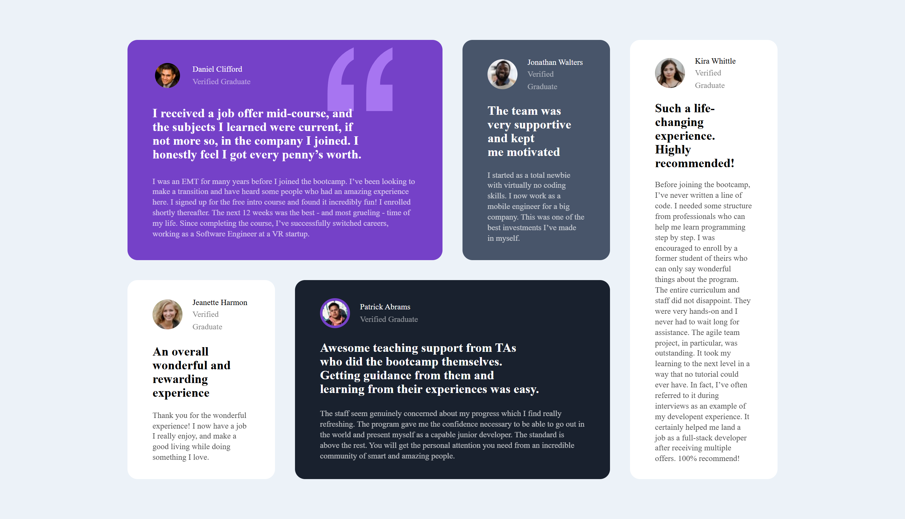
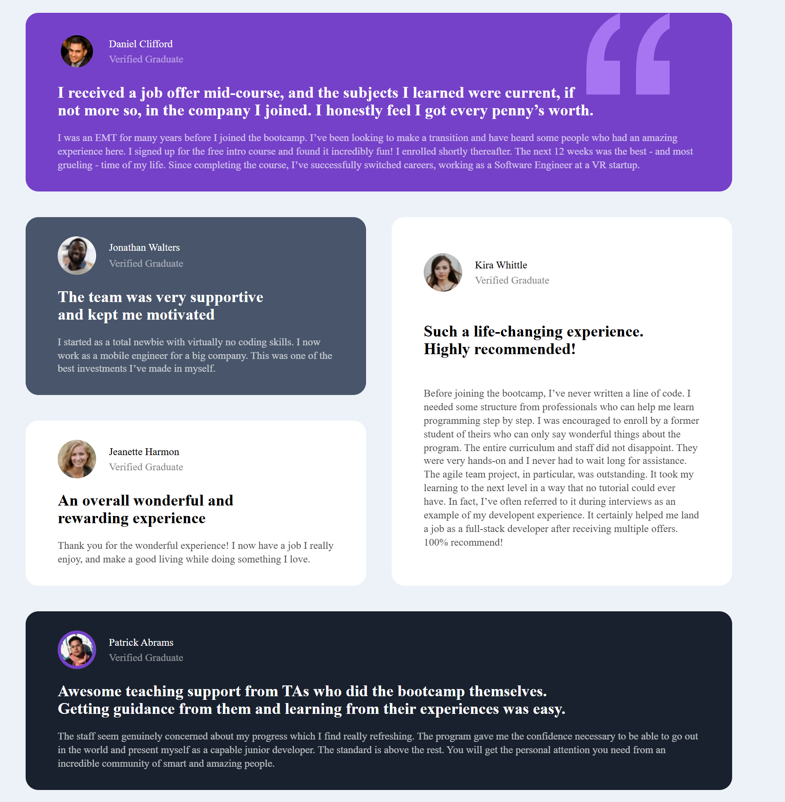

# Frontend Mentor - Testimonials grid section

This is a solution to the [Testimonials grid section on Frontend Mentor](https://www.frontendmentor.io/challenges/testimonials-grid-section-Nnw6J7Un7). Frontend Mentor challenges help you improve your coding skills by building realistic projects.

## Table of contents

- [Overview](#overview)
  - [The challenge](#the-challenge)
  - [Screenshot](#screenshot)
  - [Links](#links)
- [My process](#my-process)
  - [Built with](#built-with)
  - [What I learned](#what-i-learned)
  - [Useful resources](#useful-resources)
- [Author](#author)

## Overview

### The challenge

Users should be able to:

- View the optimal layout for the site depending on their device's screen size

### Screenshot

| Desktop View                  | Mobile View                  |
| ----------------------------- | ---------------------------- |
|  |  |
|                           Tablet View                        |
|                                  |

### Links

[Live Site URL](https://kapteynuniverse.github.io/Testimonials-Grid-Section/)

[Solution URL](https://www.frontendmentor.io/solutions/testimonial-grid-section-i1Spv4WICK)

## My process

### Built with

- Semantic HTML5 markup
- CSS custom properties
- Mobile-first workflow
- Grid
- Flexbox

### What I learned

While building this project, I improved my understanding of:

- Structuring content using semantic HTML elements like `<article>`, and `<blockquote>`

- When and how to properly use the `<blockquote>` element

- Combining CSS Grid and Flexbox for complex responsive layouts

- Managing consistent spacing and alignment across components

### Useful resources

- [The Block Quotation element](https://developer.mozilla.org/en-US/docs/Web/HTML/Reference/Elements/blockquote) : Helped me understand when to use `<blockquote>` and how it affects semantics and accessibility.
- [Mimo - Blockquote](https://mimo.org/glossary/html/blockquote) : A simpler explanation that reinforced the concept of quoted content in HTML.

## Author

- Frontend Mentor - [Asilcan Toper](https://www.frontendmentor.io/profile/KapteynUniverse)
